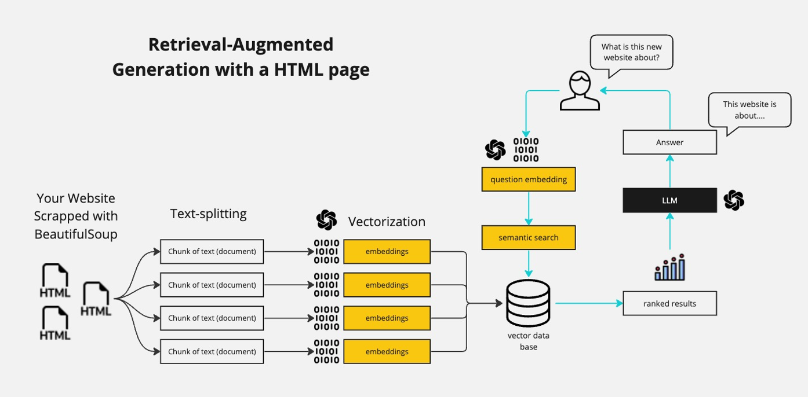

# WebChat+ - Chat with Websites from URL

<p align="center">
  
</p>

WebChat+ is an AI-powered web assistant that I built that allows anyone to interact with and extract meaningful insights from website and it's content. Built using Streamlit, LangChain, and Huggingface, WebChat+ leverages state-of-the-art language model from Mistral (Mistral-7B-Instruct-v0.2) and embeddings to facilitate intelligent conversations based on retrieved website data.

## 🚀 Features

- **Website Content Processing**: Extracts and tokenizes website content for efficient retrieval.
- **Conversational AI**: Uses a retrieval-augmented generation (RAG) model to answer user queries based on website data.
- **Hugging Face Integration**: Utilizes models from Hugging Face Hub for intelligent response generation.
- **Vector Store for Retrieval**: Employs ChromaDB for semantic search and fast document retrieval.
- **Streamlit UI**: Provides a user-friendly and interactive chat experience.
- **Real-Time API Status Check**: Displays system and API connection status.
- **Customizable Settings**: Supports dynamic website input and personalized interaction.


## 🛠️ Installation & Setup
#### Prerequisites

```python
Python 3.8+
pip
A Hugging Face API token (required for model access)
```

#### Clone the Repository
```
git clone https://github.com/yourusername/WebChatPlus.git
cd WebChatPlus
```

#### Requirements
```
pip install -r requirements.txt
```

#### Set Up Environment Variables
Create a ```.env``` file in the root directory and add your Hugging Face API token:
```
HUGGINGFACEHUB_API_TOKEN=your_api_token_here
```


## Tech Stack
<p>


</p>

```python
Frontend: Streamlit
Language Models: Hugging Face Hub (e.g., Mistral-7B-Instruct-v0.2)
Embeddings: Hugging Face Embeddings (e.g., sentence-transformers/all-MiniLM-L6-v2)
Vector Store: Chroma
Text Processing: LangChain, BeautifulSoup, RecursiveCharacterTextSplitter
Environment Management: dotenv
```

## 🔧 Usage

#### Run the Streamlit app
Once the application starts, follow these steps:

1. Enter a website URL in the sidebar.
2. Wait for content processing to complete.
3. Ask questions related to the website content.


## 📌 How It Works

- **Content Loading**: Extracts text from the given website URL.
- **Text Splitting**: Breaks the content into manageable chunks for better retrieval.
- **Embedding Generation**: Converts text into vector embeddings using Hugging Face models.
- **Vector Storage & Retrieval**: Stores the embeddings in ChromaDB for quick semantic search.
- **Conversational RAG Model**: Uses LangChain to retrieve relevant content and generate responses.
- **Response Processing**: Filters and cleans responses before displaying them in chat


📷 Screenshots
<p align="center">
  
</p>


## 📞 Contact

Developed by Abenezer Tesfaye

GitHub: @yourusername
Email: your.email@example.com
LinkedIn: Your LinkedIn Profile


